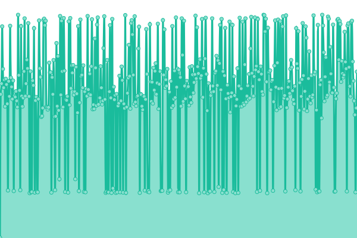
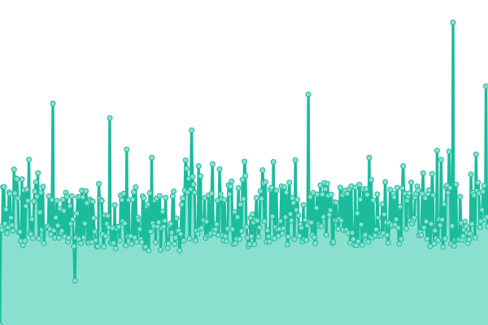
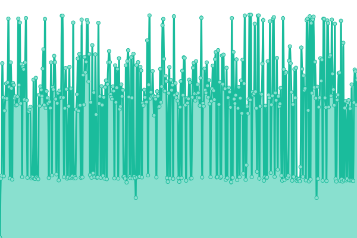
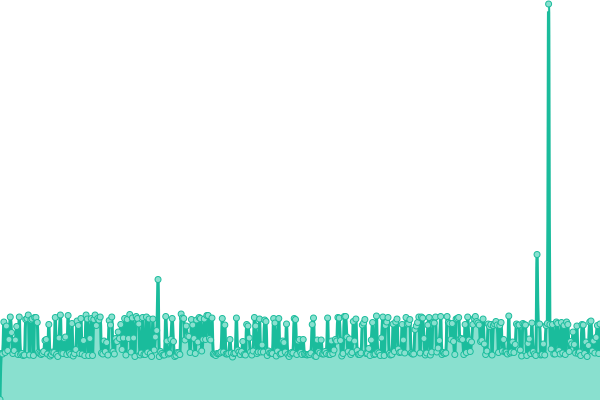
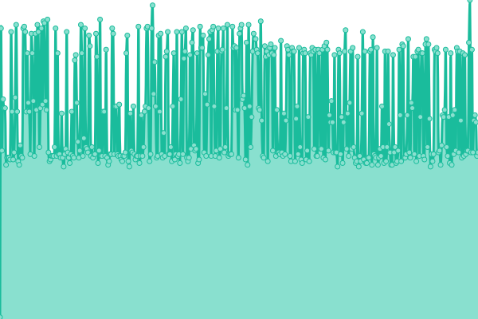
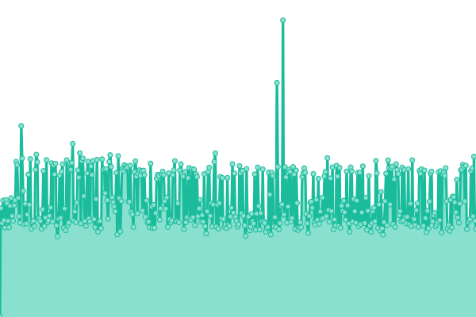

# [📈 Live Status](https://status.jojoxd.nl): <!--live status--> **🟨 Degraded performance**

This repository contains the open-source uptime monitor and status page for [Joey "JojoXD" Vos](jojoxd.nl), powered by [Upptime](https://github.com/upptime/upptime).

With [Upptime](https://upptime.js.org), you can get your own unlimited and free uptime monitor and status page, powered entirely by a GitHub repository. We use [Issues](https://github.com/jojoxd/site-status/issues) as incident reports, [Actions](https://github.com/jojoxd/site-status/actions) as uptime monitors, and [Pages](https://status.jojoxd.nl) for the status page.

<!--start: status pages-->
<!-- This summary is generated by Upptime (https://github.com/upptime/upptime) -->
<!-- Do not edit this manually, your changes will be overwritten -->
<!-- prettier-ignore -->
| URL | Status | History | Response Time | Uptime |
| --- | ------ | ------- | ------------- | ------ |
|  [JojoXD.nl](https://jojoxd.nl) | 🟩 Up | [jojo-xd-nl.yml](https://github.com/jojoxd/site-status/commits/HEAD/history/jojo-xd-nl.yml) | 

 209ms
     
 | 

<a href="https://status.jojoxd.nl/history/jojo-xd-nl">100.00%</a>
    

|  [gitlab.jojoxd.nl](https://gitlab.jojoxd.nl) | 🟩 Up | [gitlab-jojoxd-nl.yml](https://github.com/jojoxd/site-status/commits/HEAD/history/gitlab-jojoxd-nl.yml) | 

 998ms
     
 | 

<a href="https://status.jojoxd.nl/history/gitlab-jojoxd-nl">100.00%</a>
    

|  [Desu](https://desu.jojoxd.nl) | 🟨 Degraded | [desu.yml](https://github.com/jojoxd/site-status/commits/HEAD/history/desu.yml) | 

 324ms
     
 | 

<a href="https://status.jojoxd.nl/history/desu">99.98%</a>
    

|  [Anime RSS Filter (v2)](https://desu.jojoxd.nl/anime-rss-filter) | 🟨 Degraded | [anime-rss-filter-v2.yml](https://github.com/jojoxd/site-status/commits/HEAD/history/anime-rss-filter-v2.yml) | 

 156ms
     
 | 

<a href="https://status.jojoxd.nl/history/anime-rss-filter-v2">99.98%</a>
    

|  [BakaBot](https://desu.jojoxd.nl/bakabot) | 🟩 Up | [baka-bot.yml](https://github.com/jojoxd/site-status/commits/HEAD/history/baka-bot.yml) | 

 120ms
     
 | 

<a href="https://status.jojoxd.nl/history/baka-bot">100.00%</a>
    

|  [Email (Webmail)](https://mail.jojoxd.nl) | 🟩 Up | [email-webmail.yml](https://github.com/jojoxd/site-status/commits/HEAD/history/email-webmail.yml) | 

 679ms
     
 | 

<a href="https://status.jojoxd.nl/history/email-webmail">100.00%</a>
    

<!--end: status pages-->

[**Visit our status website →**](https://status.jojoxd.nl)

## 📄 License

- Powered by: [Upptime](https://github.com/upptime/upptime)
- Code: [MIT](./LICENSE) © [Joey "JojoXD" Vos](jojoxd.nl)
- Data in the `./history` directory: [Open Database License](https://opendatacommons.org/licenses/odbl/1-0/)
